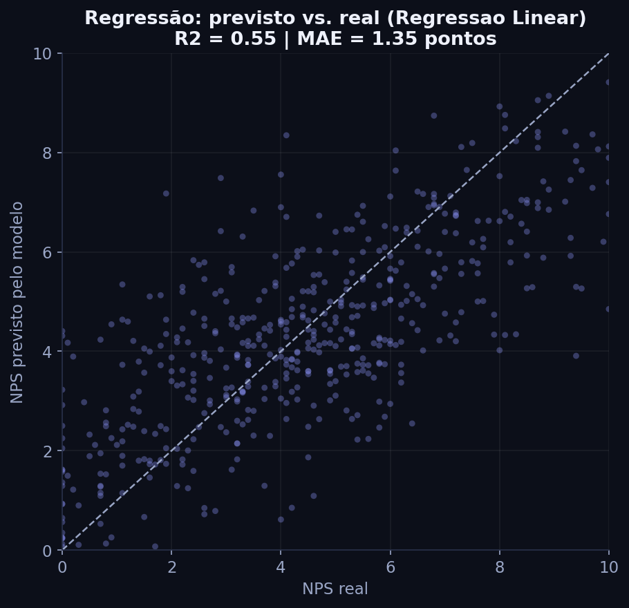
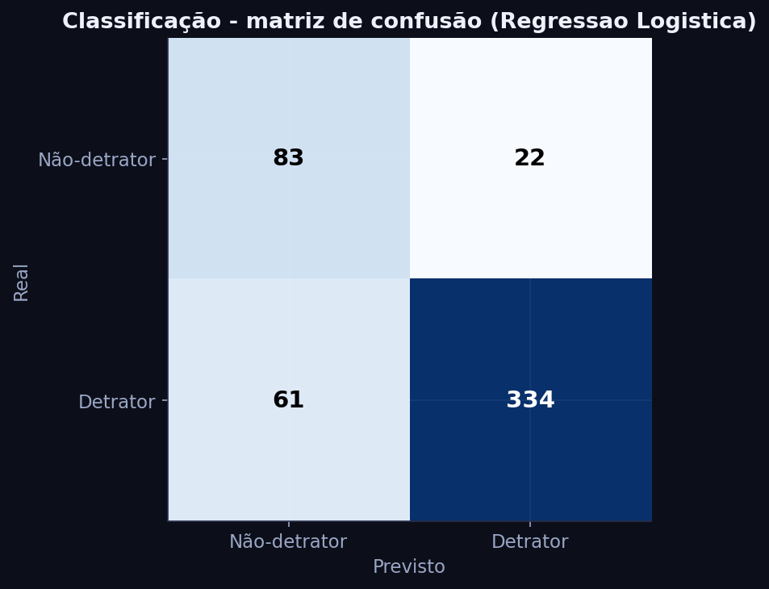
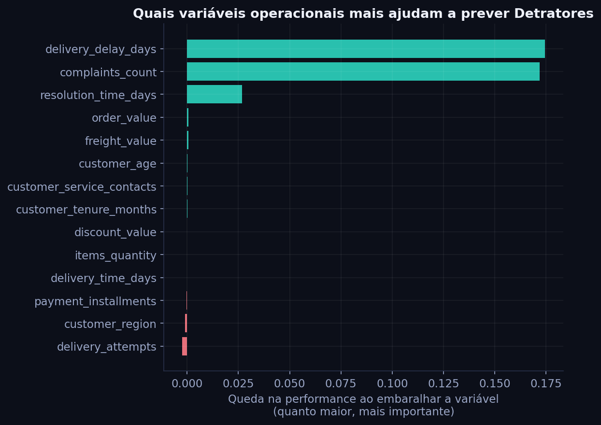
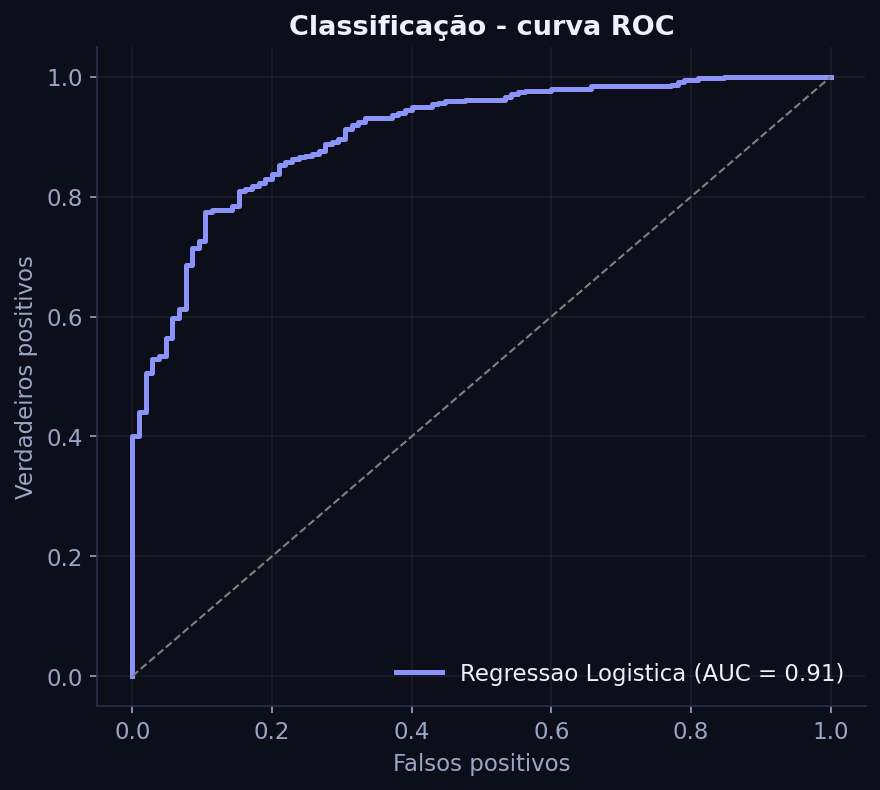

# 4. Estratégia Preditiva

Esta é a parte opcional do desafio, que eu decidi implementar. Aqui mostro como a
Ciência de Dados pode antecipar o NPS antes da pesquisa, cobrindo as fases de
Modeling e Evaluation do CRISP-DM mais uma reflexão sobre como isso entraria em
produção. Os números abaixo são gerados pelo `src/modeling.py` e ficam salvos em
`models/metrics.json`.

## A estratégia, em uma frase

Usar só dados operacionais (pedido, logística e atendimento), que já existem antes da
pesquisa, para estimar a nota de NPS com uma regressão e sinalizar clientes com risco
de virar detrator com uma classificação. A ideia é dar à operação a chance de agir de
forma preventiva.

Eu fiz as duas abordagens que o enunciado sugere porque elas respondem a perguntas
diferentes e se complementam. A regressão responde "qual nota esse pedido tende a
receber?", o que serve para priorizar por grau de risco e acompanhar tendência. A
classificação responde "esse cliente vai virar detrator, sim ou não?", que é o que a
operação precisa para decidir se aciona ou não a recuperação.

## Definição da variável-alvo

Na regressão o alvo é o `nps_score` contínuo (0 a 10). Na classificação é o
`is_detrator`, que vale 1 quando a nota arredondada é até 6. A parte conceitual da
target e a régua de categorização estão em [`02_definicao_target.md`](02_definicao_target.md).

## Seleção e preparação das variáveis de entrada

O princípio que guia tudo é: só entram variáveis que existem no momento da previsão e
que representam alavancas em que dá para mexer. Por isso uso as variáveis operacionais
e deixo de fora duas que são perigosas:

| Variável excluída | Por quê |
|---|---|
| `repeat_purchase_30d` | Só é conhecida até 30 dias depois do pedido, então é vazamento. |
| `csat_internal_score` | É outra medida de satisfação, então prever NPS com ela é circular. |

As 14 variáveis que entram são todas operacionais: valor e itens do pedido, desconto,
parcelas, tempo de entrega, atraso na entrega, frete, tentativas de entrega, contatos
com atendimento, tempo de resolução, número de reclamações, idade, tempo de casa e
região.

Na preparação (que está no `src/data_preparation.py` e no pré-processamento do
pipeline) eu valido a qualidade da base, confirmo que não há nulos nem duplicatas,
crio as colunas-alvo, padronizo as variáveis numéricas para ajudar os modelos lineares
e aplico one-hot na região. Tudo isso vive dentro de um Pipeline do scikit-learn, o
que evita vazamento entre treino e teste e deixa o modelo fácil de reaplicar.

## Lógica de separação dos dados

Separo 80% para treino (2.000 pedidos) e 20% para teste (500), estratificando por
`is_detrator` para manter a mesma proporção de detratores nos dois lados. A semente é
fixa (`random_state = 42`) para o resultado ser reproduzível, e uso validação cruzada
de 5 folds no treino para checar se o melhor modelo é estável. A mesma divisão vale
para regressão e classificação, então a comparação é justa.

## Escolha do modelo

Comparei modelos simples e interpretáveis com modelos de árvore mais flexíveis, sempre
contra um baseline ingênuo, para provar que existe ganho real.

Na regressão, o melhor foi a Regressão Linear:

| Modelo | MAE | RMSE | R² |
|---|---|---|---|
| Baseline (média) | 2,09 | 2,55 | 0,00 |
| Regressão Linear | 1,35 | 1,72 | 0,545 |
| Random Forest | 1,42 | 1,78 | 0,512 |
| Gradient Boosting | 1,37 | 1,73 | 0,540 |

O R² em validação cruzada ficou em 0,552 com desvio de 0,028, ou seja, estável. O
modelo explica perto de 55% da variação do NPS usando só dados operacionais e erra em
média 1,35 ponto na escala de 0 a 10. Fiquei com a Regressão Linear porque ela empata
com as árvores e é mais simples e fácil de explicar.

Na classificação, o melhor por AUC foi a Regressão Logística:

| Modelo | Acurácia | Acur. balanceada | Precisão (det.) | Recall (det.) | F1 | ROC-AUC |
|---|---|---|---|---|---|---|
| Baseline (mais frequente) | 0,79 | 0,50 | 0,79 | 1,00 | 0,88 | 0,50 |
| Regressão Logística | 0,834 | 0,818 | 0,938 | 0,846 | 0,889 | 0,905 |
| Random Forest | 0,854 | 0,705 | 0,868 | 0,962 | 0,912 | 0,898 |

Escolhi a Regressão Logística como modelo de referência porque ela tem a melhor AUC
(0,905) e a melhor acurácia balanceada (0,818), o que quer dizer que acerta bem os dois
lados, e não só a classe majoritária como o baseline faz. A Random Forest é uma
alternativa válida quando o objetivo for pegar o máximo de detratores possível (ela
acha 96%), ao custo de gerar mais alarmes falsos.

## Avaliação dos resultados

Não dá para olhar só a acurácia. Como 79% da base é detratora, chutar "detrator
sempre" já daria 79% de acurácia e seria inútil. Por isso priorizei ROC-AUC, acurácia
balanceada e recall de detratores.

Na matriz de confusão da Regressão Logística, com os 500 clientes de teste, dos 395
detratores reais o modelo identifica 334 (recall de 85%), e dos que ele aponta como
detrator, 94% realmente são (precisão alta, poucos alarmes falsos). A importância das
variáveis, calculada por permutação, mostra atraso na entrega e número de reclamações
dominando, exatamente os vilões que apareceram na EDA. Ou seja, o modelo aprendeu a
olhar para o que o negócio consegue atacar.

Sobre o vazamento, dá para ver na prática. Se eu incluir o `repeat_purchase_30d` e o
`csat_internal_score`, as métricas melhoram:

| Métrica | Só operacional | Com as variáveis suspeitas |
|---|---|---|
| ROC-AUC (classificação) | 0,898 | 0,944 |
| R² (regressão) | 0,548 | 0,645 |

Um detalhe de método: essa demonstração usa Random Forest nas duas colunas e um split
próprio, só para isolar o efeito das variáveis suspeitas. Por isso os valores da coluna
"Só operacional" (0,898 e 0,548) ficam um pouco diferentes do meu modelo de referência
(Regressão Logística, 0,905) e da Regressão Linear principal (0,545). O que importa aqui
é o salto ao incluir as variáveis, não o número absoluto.

Mesmo com esse ganho, eu mantenho as duas de fora, porque elas não estão disponíveis na
hora da previsão e são proxies de satisfação. Um modelo melhor no papel que não
funciona na vida real é pior do que um modelo honesto e aplicável.

## Como a solução seria usada na prática

A ideia é gerar um score preventivo por pedido. A cada pedido em andamento, o modelo
calcula a probabilidade de o cliente virar detrator com os dados operacionais que já
existem. A partir disso, dá para ter gatilhos de ação que nem dependem do modelo nos
casos óbvios: atraso de 2 dias ou mais, ou a segunda reclamação, já manda o pedido para
uma fila de recuperação proativa (avisar, compensar, priorizar a entrega), e vários
contatos com o atendimento escalam para uma resolução definitiva. A importância das
variáveis também ajuda a priorizar onde investir primeiro, que é pontualidade da
entrega e redução de reclamações. Por fim, em produção eu compararia o NPS previsto
com o realizado e retreinaria de tempos em tempos para evitar que o modelo envelheça.

Sobre as limitações, sendo honesto: a base é sintética, então os padrões precisam ser
confirmados com dados reais antes de qualquer decisão cara. Correlação não é
causalidade, então o ideal é validar as ações com teste A/B. E o modelo serve para
priorizar e apoiar a decisão, não para decidir sozinho no lugar das áreas. Antes de
automatizar qualquer ação, é bom checar se ele não está penalizando injustamente algum
grupo de clientes.

No fim, com só dados operacionais eu consigo estimar o NPS com erro de cerca de 1,35
ponto e sinalizar detratores com AUC de 0,905, antes da pesquisa. Mais importante que a
métrica, o modelo aponta alavancas em que dá para agir (atraso e reclamações), o que
permite sair de uma postura reativa para uma preventiva.
