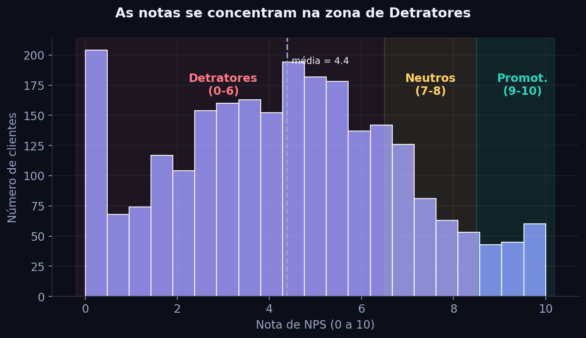
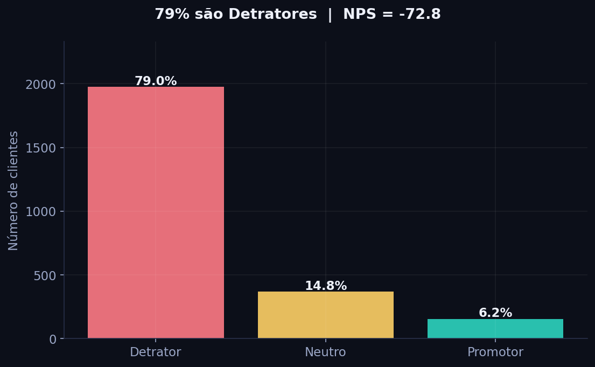
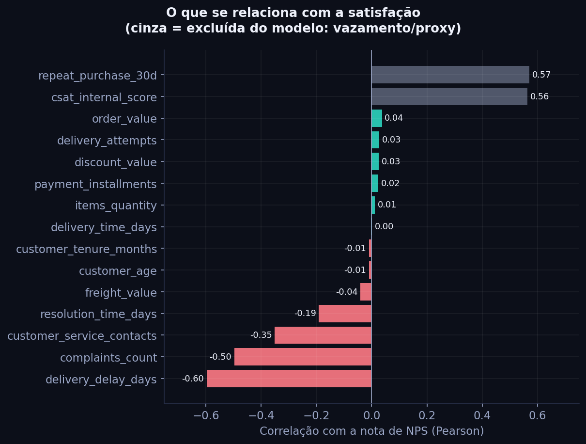
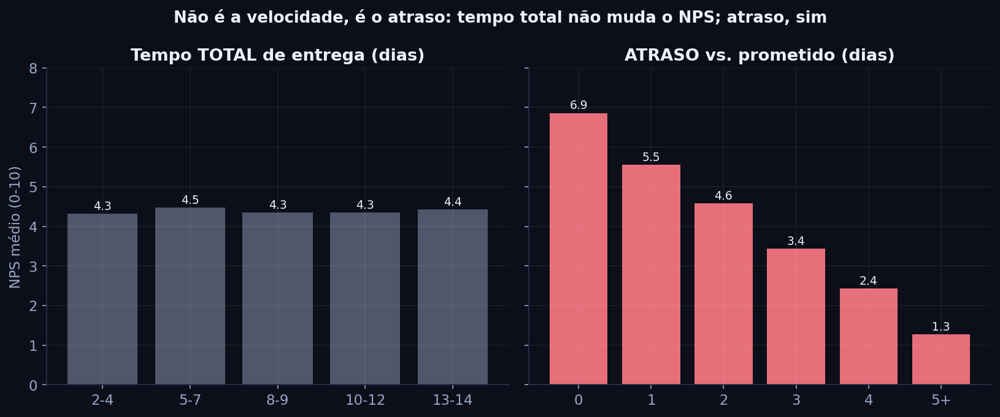
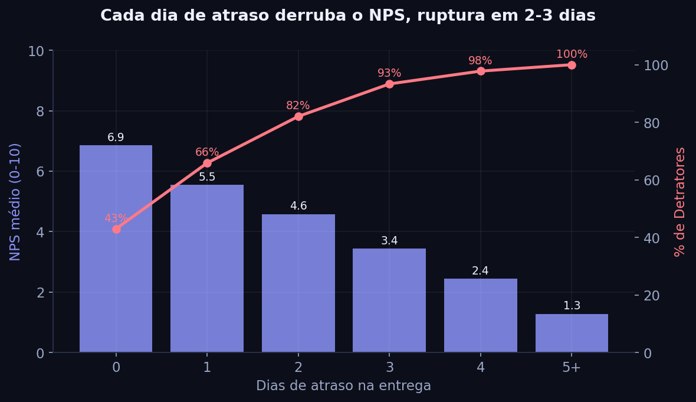
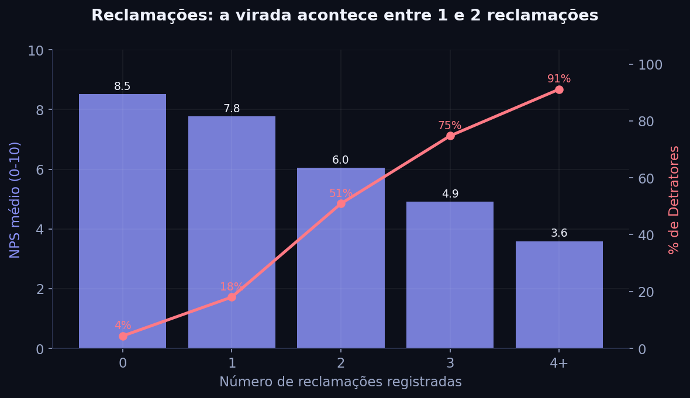
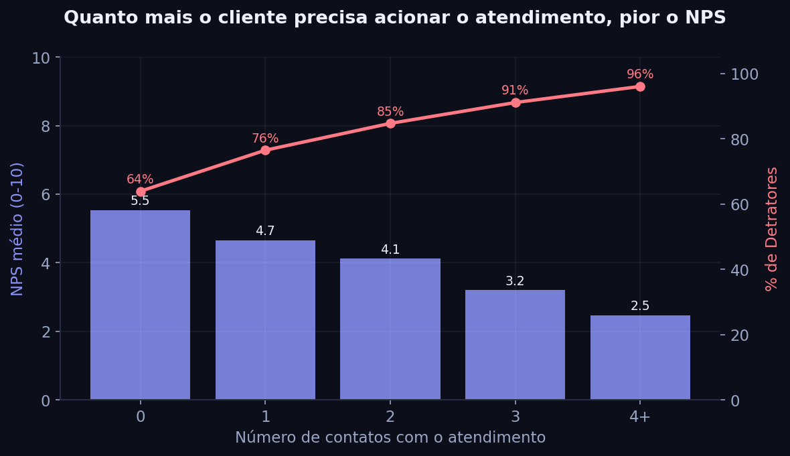
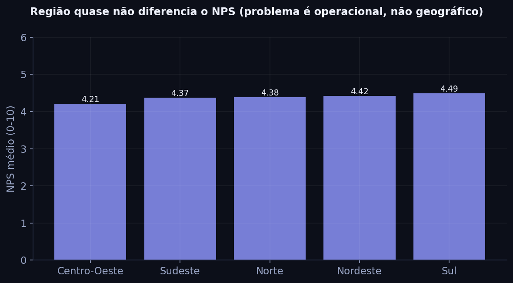

# 3. Análise Exploratória, Insights para a Gerência

Escrevi esta parte como se estivesse explicando para um gerente de operações que não
trabalha com estatística. Nada de fórmula, só o que os números dizem e o que dá para
fazer com isso. Os gráficos saem do `src/eda.py` e os números do
`reports/eda_summary.json`.

## A foto de hoje

De cada 100 clientes, 79 são detratores (insatisfeitos a ponto de não recomendar), 15
são neutros e só 6 são promotores. O NPS fica em -72,8, bem no vermelho. Para ter uma
ideia: para cada cliente que elogia a marca, tem mais de doze que reclamariam. Isso
não é problema de um pedido ou outro, é o padrão da operação hoje.

## Quais fatores são mais críticos para a satisfação

Quando a gente olha o que anda junto com a nota, três coisas saltam aos olhos, e todas
são da nossa operação: o atraso na entrega (o maior de longe), o número de reclamações
e o número de vezes que o cliente teve que falar com o atendimento.

O perfil do cliente (idade, região, tempo de casa) e o lado financeiro (valor do
pedido, frete, desconto) praticamente não mudam a nota. Isso é uma boa notícia, na
verdade: a satisfação não depende de quem é o cliente nem de quanto ele gastou, depende
de como a gente entrega e atende, e isso são coisas que controlamos.

## O que mais gera detratores

O atraso na entrega, disparado. E aqui está o achado mais importante de todos: não é o
tempo total de entrega que irrita o cliente, é o atraso em relação ao que foi
prometido. Entregas que demoram mais, mas dentro do prazo combinado, têm nota parecida.
O estrago acontece quando passa do prazo. Em outras palavras, cumprir a promessa vale
mais do que ser rápido.

Logo depois vêm as reclamações e as idas ao atendimento. Quanto mais o cliente precisa
nos acionar para resolver um problema, pior ele avalia a marca. O esforço que ele tem
acaba cansando a relação.

## Existe um ponto de ruptura na experiência?

Existe, e é bem nítido, em torno de 2 a 3 dias de atraso. A partir daí a experiência
praticamente vira de cabeça para baixo:

| Atraso na entrega | Nota média | Viram detratores |
|---|---|---|
| No prazo (0 dia) | 6,9 | 43% |
| 1 dia | 5,5 | 66% |
| 2 dias | 4,6 | 82% |
| 3 dias | 3,4 | 93% |
| 4 dias | 2,4 | 98% |
| 5 dias ou mais | 1,3 | 100% |

Repare que, no prazo, 1 em cada 4 clientes vira promotor. Com 3 dias de atraso, é quase
impossível ter promotor. Cada dia conta, e os primeiros dias são os que mais doem.

As reclamações têm um ponto de virada parecido, entre a primeira e a segunda. Com zero
reclamação, mais da metade dos clientes vira promotor. Na segunda reclamação, a maioria
já está perdida.

| Reclamações | Nota média | Viram detratores |
|---|---|---|
| 0 | 8,5 | 4% |
| 1 | 7,8 | 18% |
| 2 | 6,1 | 51% |
| 3 | 4,9 | 75% |
| 4 ou mais | 3,6 | 91% |

## Que tipo de cliente tende a ter NPS mais alto ou mais baixo

Na real, não é uma questão de tipo de cliente, é de tipo de experiência. Tende a virar
promotor quem recebeu no prazo, não precisou reclamar e não dependeu do atendimento, ou
seja, o cliente cuja operação deu certo. E tende a virar detrator quem teve atraso de 2
dias ou mais, duas ou mais reclamações, ou vários contatos com o atendimento.

Região, idade e tamanho do pedido não separam bom e mau NPS. A diferença entre regiões
é mínima. O que divide as águas é sempre a experiência operacional.

## O que fazer com isso

Algumas recomendações que saem direto da análise:

1. Proteger o prazo prometido. Vale mais prometer um prazo realista e cumprir do que
   prometer rápido e atrasar. Atacar os atrasos de 1 a 2 dias é onde a gente mais ganha.
2. Criar um alerta de risco. Pedido que atrasou 2 dias ou chegou à segunda reclamação
   deveria entrar numa fila de recuperação proativa (avisar o cliente, compensar,
   priorizar) antes de mandar a pesquisa.
3. Resolver no primeiro contato. Cada ida extra ao atendimento derruba a nota, então
   menos esforço para o cliente significa mais satisfação.
4. Parar de tentar comprar satisfação com desconto. Os dados mostram que preço e
   desconto pouco mexem no NPS, então o dinheiro rende mais em pontualidade e
   atendimento.

A boa notícia da EDA é que os três maiores vilões são operacionais e acionáveis. Na
parte 4 eu transformo esse diagnóstico em um modelo que sinaliza o risco de detrator
antes da pesquisa.
